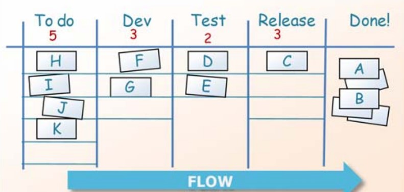

# Kanban

Kanban es un método que hace más fácil la gestión del trabajo en los equipos. Está basado en el principio de "producción justo a tiempo" y se puede aplicar en múltiples industrias y contextos.

## ¿Qué ganamos?

* Podemos monitorear el trabajo realizado y los avances que se logran.
* Identificamos los cuellos de botella antes de que generen problemas.
* Aseguramos que el trabajo no exceda la capacidad productiva, ni quede capacidad sin aprovechar.
* Agilizamos el flujo de trabajo sin recurrir a metodologías más complejas como [Scrum](Scrum.md).

## ¿Cómo lo aplicamos?

¡Solo hay que armar un tablero como el de la foto! Es muy fácil y se logra en tres pasos.

Primero **visualizamos el flujo de trabajo**:
* Dividimos el trabajo en tareas manejables.
* Listamos los estados que puede tener cada tarea.
* Volcamos toda la información en un tablero.
* *Por ejemplo: Una compañía organizará un evento por su aniversario. Se invitarán clientes y socios importantes. Dividimos "organizar evento" en "armar lista de invitados", "contratar catering", "alquilar salón", etc. Cada tarea puede estar "pendiente", "en progreso" o "terminada". La información la colocamos en un tablero en una pared que esté a la vista, para que todos estén al tanto del progreso.*

Luego **limitamos la cantidad de tareas** que pueden estar realizándose:
* Simplemente le ponemos un número a cada columna.
* Listo! Así nos aseguramos que el equipo no tome trabajo que lo sobrepasa, pero que al mismo tiempo se enfoque en terminar lo que está haciendo para poder pasar a las siguientes tareas.
* *Por ejemplo: La empresa destina 5 personas a la organización del evento. Cada persona puede realizar máximo dos tareas al mismo tiempo sin agobiarse. Entonces nuestro límite son 10 tareas en progreso.*

Por último, **medimos el tiempo de las tareas**:
* Medimos cuanto lleva cada tarea, desde que la escribimos hasta que el equipo la completa.
* Esto nos ayuda a conocer mejor el ritmo de trabajo del equipo, y hace más fácil realizar proyecciones realistas para futuros proyectos.
* *Por ejemplo: La empresa en cuestión se dedica a la organización de eventos. Si le llevó un mes organizar su fiesta de aniversario, a la cual acudieron 100 personas, ya sabe que organizar un evento similar para un futuro cliente le llevará ese tiempo.*

## Kanban + Scrum = Scrumban

Se puede incorporar Kanban a un equipo que ya utiliza Scrum desde antes. Solamente se debe tomar el tablero Scrum, agregarle un limite de tareas por columna y empezar a medir el tiempo.

En el caso contrario, un equipo que usa Kanban puede estar interesado en incorporar Scrum. En ese caso el tablero ya lo tienen, y lo que hay que agregar son los rituales Scrum: los Sprints, la planificación de Sprints, la Daily, la Demo, etc. Hay más información sobre esto en el artículo sobre [Scrum](Scrum.md).

## Fuentes
[Henrik Kniberg, Kanban and Scrum: Making the most of both, 2010](https://www.agileleanhouse.com/lib/lib/People/HenrikKniberg/KanbanAndScrumInfoQVersionFINAL.pdf)
[Benjamin Coriat, Penser à l'envers, 1991](https://www.amazon.fr/Penser-lenvers-organisation-lentreprise-japonaise/dp/2267012464)