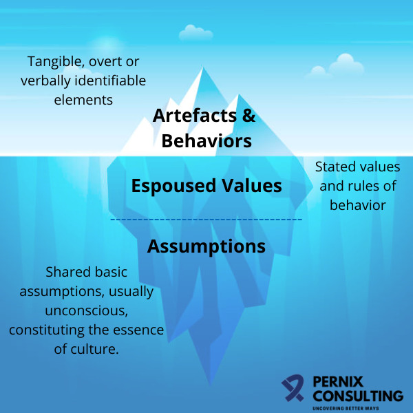

# Cultura

En una organización, la cultura es un conjunto de presunciones que los miembros desarrollaron a lo largo del tiempo al enfrentarse juntos a problemas de adaptación externa e integración interna, que se consideran válidas y se enseñan como forma correcta de pensar, sentir y resolver problemas.

O sea, la cultura:
* Es compartida por los miembros de una comunidad.
* Está conformada por supuestos que se asentaron con el tiempo.
* Estos supuestos se enseñan a los nuevos miembros.
* Orienta la conducta y la forma de pensar de las personas.

*Ejemplo: Una empresa de software tiene una gran cultura de innovación, donde los gerentes y trabajadores comparten la creencia de que el surgimiento y adopción de nuevas tecnologías es algo positivo para la productividad, guiándolos a que siempre estén buscando nuevas formas de hacer las cosas, y enseñando esta filosofía a los nuevos trabajadores que se incorporan a la compañía.*

## Niveles de la cultura

La cultura tiene niveles de mayor y menor dificultad de percepción.

* **Artefactos y comportamientos:** Entorno físico y social visible a simple vista. *Ejemplo: Cómo está organizada la oficina, la disposición de las mesas y sillas, palabras utilizadas en la comunicación entre pares, etc.*

* **Valores y creencias:** Creencias compartidas sobre como deben hacerse las cosas y valores que se promueven, conformando la filosofía de la organización. No es visible a simple vista, pero pueden identificarse en las conversaciones que se dan entre las personas y en las normas de la organización. *Ejemplo: Ideas como la transparencia, la meritocracia, la igualdad de oportunidades, etc.*

* **Supuestos básicos:** Es el nivel más complejo de ver, ya que son ideas implícitas e indiscutibles, comunes a todos los miembros. Están tan asentadas e internalizadas en las personas que prácticamente no se mencionan. *Ejemplo: Asunciones como la búsqueda de lucro en una empresa, la maximización de la productividad por parte de los empleados, el evitar reuniones innecesarias, etc.*

## Impactos de la cultura

La cultura influye en:
* El comportamiento y las acciones de las personas.
* Productividad, eficiencia y resolución de problemas.
* Percepción de la organización en el mundo exterior.
* Aprovechamiento de oportunidades.
* Generación de ventajas competitivas.
* Incorporación y retención de empleados.

## Fuentes
[Edgar Schein, Organizational Culture and Leadership, 5th Edition (2016)](https://www.wiley.com/en-us/Organizational+Culture+and+Leadership%2C+5th+Edition-p-9781119212041)