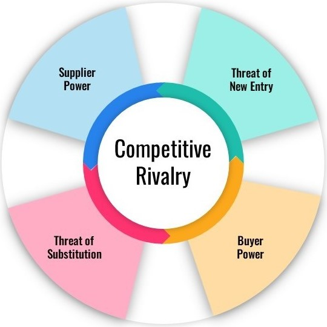

# Fuerzas de Porter

Las **cinco fuerzas de Porter** es un modelo utilizado en negocios para analizar las fuerzas competitivas que influencian a un mercado, permitiendo identificar las fortalezas y debilidades de las empresas que participan en él y ayudándolas a definir su estrategia.

* **Amenaza de nuevos participantes:** ¿Qué tan fácil es para un nuevo competidor insertarse en nuestro mercado?. La respuesta dependerá de barreras de entrada como:
    * Inversión inicial necesaria.
    * Facilidad para desarrollar las habilidades requeridas.
    * Regulaciones gubernamentales.
    * Economías de escala ya asentadas.
    * Existencia de marcas diferenciadas con lealtad de los consumidores.

*Ejemplo: En un extremo podemos pensar en las ferias de artesanías, a las cuales es muy fácil entrar y por eso vemos nuevos puestos todo el tiempo. En el otro extremo, tenemos los astilleros navales, que demandan una inversión de capital gigante, además de superar muchas regulaciones y encontrar a personal capacitado.*

* **Poder de los proveedores:** ¿Qué tanta influencia tienen los proveedores sobre nuestras actividades? ¿Podemos sustituirlos si lo necesitamos?. Tenemos que pensar en:
    * Cantidad de proveedores disponibles.
    * Tamaño de los proveedores.
    * Existencia de otros clientes para los proveedores.
    * Diferenciación de sus productos/servicios.
    * Costos asociados a cambiar de proveedor.

*Ejemplo: Una fábrica que utiliza mucha electricidad para producir se verá afectada por el aumento de tarifas de su proveedor de energía, ya que este tiene un monopolio en la ciudad, y no existen otras opciones para abastecer las actividades. En el caso contrario, un supermercado minorista puede reemplazar a su proveedor de tomates por uno más barato, ya que existen muchos productores pocos diferenciados.*

## Fuentes
[Michael Porter, Competitive Strategy, 1980](https://www.hbs.edu/faculty/Pages/item.aspx?num=195)