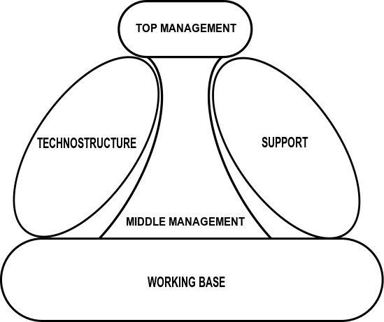

# Partes de una organización

En una organización pueden identificarse las siguientes partes:

* **Cumbre estratégica:** Tiene la responsabilidad general de la organización, definiendo su estrategia y objetivos globales, y gestionando las relaciones que la organización tiene con su entorno. *Ejemplo: El CEO y la junta directiva de una sociedad anónima.*
* **Línea media:** Está a cargo de las unidades que componen a la organización. Toma decisiones tácticas que afectan al desempeño de su unidad, supervisa que los objetivos se alcancen y estén alineados con los globales, y cumple funciones comunicativas entre la cumbre estratégica y el núcleo operativo. *Ejemplo: El gerente de ventas de una empresa que vende productos al por menor.*
* **Núcleo operativo:** Personas que producen los productos y servicios de la organización. *Ejemplo: Los ingenieros de software que construyen un sistema que luego será vendido.*
* **Tecnoestructura:** Constituido por personal que estandariza y mejora el trabajo de las otras partes. *Ejemplo: Los analistas de control de calidad en una fábrica se aseguran que los procesos de producción seguidos por los obreros sean los adecuados según las normas ISO.*
* **Staff de apoyo:** Constituido por personal que realiza actividades que no son la actividad principal de la organización, pero hacen posible su realizacion. *Ejemplo: El personal de cocina de una multinacional le prepara el almuerzo a más de 100 empleados.*

## Fuentes
[Henry Mintzberg, Structure in 5's: Designing effective organizations](https://mintzberg.org/books/structure-5s-designing-effective-organizations)